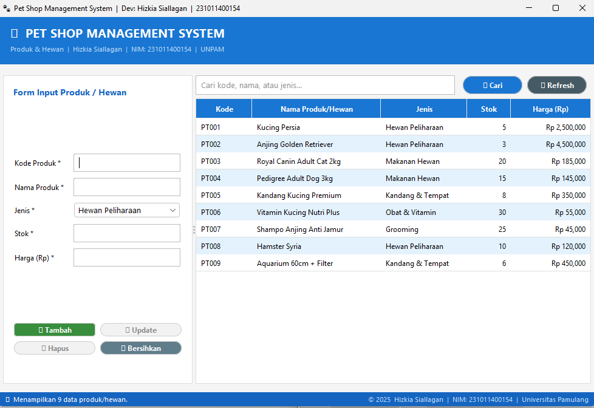
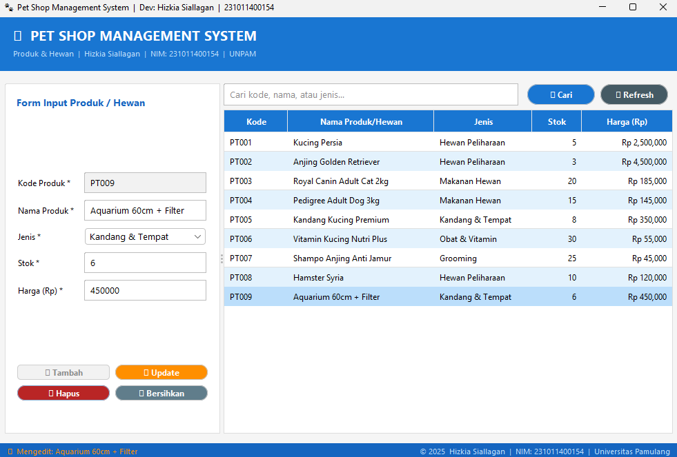
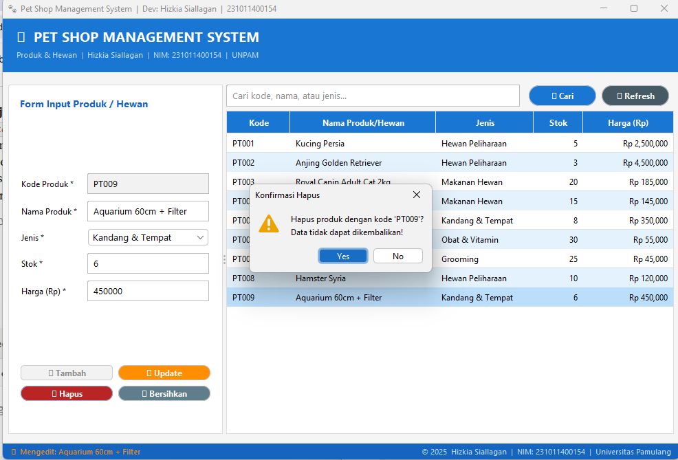
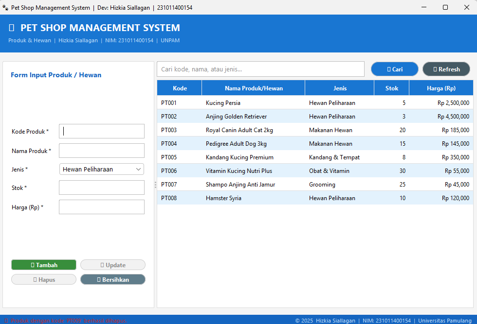
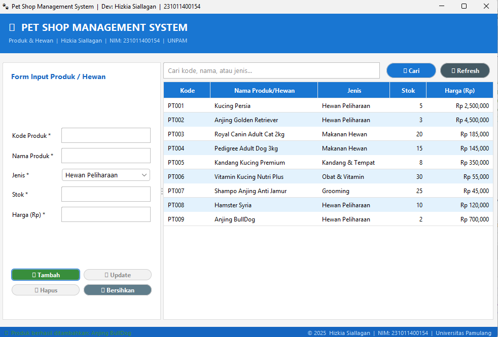
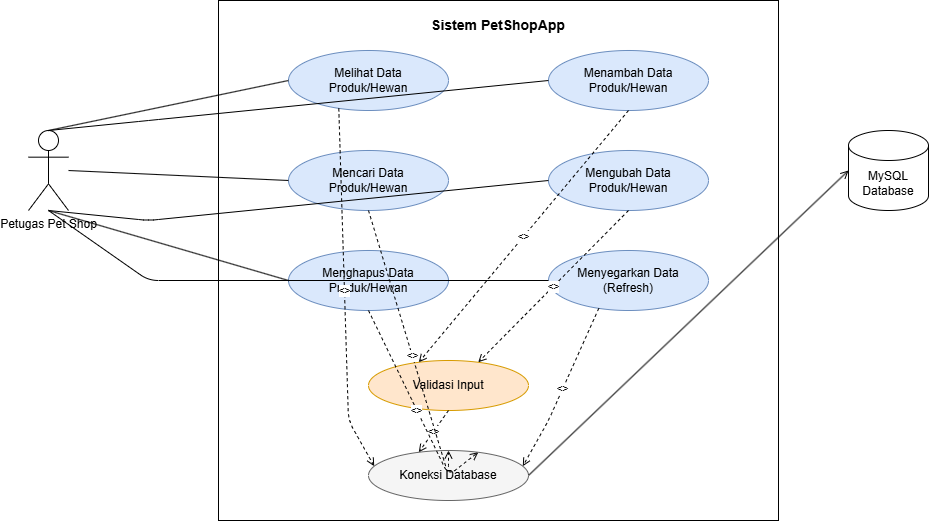

<div align="center">

# 🐾 PetShopApp

### Pet Shop Management System — Desktop CRUD Application

Aplikasi desktop manajemen data produk & hewan peliharaan berbasis **Java Swing** dengan database **MySQL**, dibangun di atas project **NetBeans (Ant-based)**.

[](https://www.oracle.com/java/)
[](#)
[](#)
[](#)
[](LICENSE)

</div>

---

## 📖 Tentang Aplikasi

**PetShopApp** adalah aplikasi desktop sederhana untuk mengelola data **produk dan hewan peliharaan** pada sebuah Pet Shop. Aplikasi ini dibangun sebagai implementasi konsep **Pemrograman Berorientasi Objek (OOP)** dan operasi **CRUD (Create, Read, Update, Delete)** menggunakan Java Swing untuk antarmuka dan MySQL (via JDBC) sebagai media penyimpanan data.

| Info | Keterangan |
|---|---|
| 👤 Developer | **Hizkia Siallagan** |
| 🆔 NIM | 231011400154 |
| 🏫 Institusi | Universitas Pamulang (UNPAM) |
| 🎓 Program Studi | Teknik Informatika |
| 📚 Mata Kuliah | Pemrograman Berbasis Objek / Praktikum Java |

---

## ✨ Fitur Utama

- ➕ **Tambah Data** — menambahkan data produk/hewan baru ke database
- 📋 **Lihat Data** — menampilkan seluruh data dalam tabel (JTable)
- ✏️ **Update Data** — mengubah data yang sudah ada
- 🗑️ **Hapus Data** — menghapus data dengan konfirmasi dialog
- 🔍 **Cari Data** — pencarian berdasarkan kode, nama, atau jenis
- ↺ **Refresh Data** — memuat ulang data terbaru dari database
- ✅ **Validasi Input** — mencegah data kosong/format salah sebelum disimpan
- 🎨 **Tampilan modern** — terintegrasi dengan [FlatLaf](https://www.formdev.com/flatlaf/) untuk UI yang lebih flat & rapi

---

## 🛠️ Tech Stack

| Layer | Teknologi |
|---|---|
| Bahasa | Java (JDK 11+) |
| GUI | Java Swing (GridBagLayout, JTable, JOptionPane) + FlatLaf |
| Database | MySQL 8.x |
| Konektor | MySQL Connector/J (JDBC) |
| IDE | Apache NetBeans (Ant-based project) |
| Arsitektur | MVC sederhana (Model–DAO–View) |

---

## 📁 Struktur Repository

> ⚠️ Source code project berada di dalam subfolder **`PetShopApp/`**, terpisah dari folder `images/` di root.

```
PetShopApp/                              ← root repository
├── README.md                            ← dokumen ini
├── LICENSE
├── images/                               ← screenshot aplikasi & diagram use case
│   ├── README.md
│   ├── 01-tampilan-utama.png
│   ├── 02-pilih-data-edit.png
│   ├── 03-konfirmasi-hapus.png
│   ├── 04-setelah-hapus.png
│   ├── 05-setelah-tambah.png
│   └── 06-use-case-diagram.png
└── PetShopApp/                           ← source code project (buka folder ini di NetBeans)
    ├── USE_CASE.md                       ← dokumentasi use case lengkap
    ├── build.xml
    ├── manifest.mf
    ├── db_Petshop_231011400154.sql       ← script pembuatan database
    ├── lib/
    │   └── mysql-connector-j-8.0.33.jar  ← download manual, lihat bagian Instalasi
    ├── nbproject/
    │   ├── project.xml
    │   └── project.properties
    └── src/
        └── petshopapp/
            ├── MainApp.java              ← entry point aplikasi
            ├── MainFrame.java            ← GUI utama (Swing)
            ├── Produk.java               ← model / entity
            ├── ProdukDAO.java            ← data access object (CRUD ke MySQL)
            └── DatabaseConnection.java   ← koneksi JDBC ke MySQL
```

---

## 🗄️ Struktur Database

**Database:** `db_Petshop_231011400154`
**Tabel:** `produk_hewan`

| Kolom    | Tipe Data      | Keterangan        |
|----------|----------------|--------------------|
| `kode`   | VARCHAR(20)    | Primary Key        |
| `nama`   | VARCHAR(100)   | Nama produk/hewan   |
| `jenis`  | VARCHAR(50)    | Kategori/jenis      |
| `stok`   | INT            | Jumlah stok         |
| `harga`  | DECIMAL(15,2)  | Harga satuan (Rp)   |

Script lengkap (struktur + 10 data contoh) ada di [`PetShopApp/db_Petshop_231011400154.sql`](PetShopApp/db_Petshop_231011400154.sql).

---

## 🚀 Instalasi & Menjalankan Project

### 1. Clone repository
```bash
git clone https://github.com/volthz001/PetShopApp.git
cd PetShopApp/PetShopApp
```
> Perhatikan: kamu harus masuk ke folder `PetShopApp/PetShopApp` (subfolder project), bukan hanya `PetShopApp/` (root repo).

### 2. Siapkan Database MySQL
Jalankan file `db_Petshop_231011400154.sql` melalui phpMyAdmin, MySQL Workbench, atau terminal:
```bash
mysql -u root -p < db_Petshop_231011400154.sql
```

### 3. Download MySQL Connector/J
Unduh dari situs resmi: https://dev.mysql.com/downloads/connector/j/
Pilih versi **8.0.x → Platform Independent → ZIP**, ekstrak, lalu salin file `.jar`-nya ke folder `lib/` di dalam subfolder project (`PetShopApp/PetShopApp/lib/`).

> 💡 File `.jar` ini **tidak ikut di-commit ke repo** (lihat `.gitignore`) karena ukurannya besar dan mudah di-download ulang.

### 4. (Opsional) Download FlatLaf
Untuk tampilan modern, unduh juga:
```
https://repo1.maven.org/maven2/com/formdev/flatlaf/3.5.4/flatlaf-3.5.4.jar
```
Simpan ke folder `lib/` yang sama.

### 5. Buka project di NetBeans
1. **File → Open Project** → pilih subfolder **`PetShopApp/PetShopApp`** (yang berisi `nbproject/` dan `src/`) — **bukan** folder root repo
2. Klik kanan project → **Properties → Libraries** → pastikan kedua `.jar` (MySQL Connector & FlatLaf) sudah ditambahkan
3. Sesuaikan kredensial MySQL (jika perlu) di `src/petshopapp/DatabaseConnection.java`:
   ```java
   private static final String USERNAME = "root";
   private static final String PASSWORD = "";
   ```
4. Klik **Run Project** (Shift+F6 / F6)

---

## 🖥️ Tampilan Aplikasi

### Tampilan Utama


### Memilih & Mengedit Data


### Konfirmasi Hapus Data


### Data Berhasil Dihapus


### Data Berhasil Ditambahkan


---

## 📋 Use Case



Dokumentasi use case lengkap (aktor, skenario tiap fitur, activity flow, dan pemetaan ke kode program) tersedia di **[PetShopApp/USE_CASE.md](PetShopApp/USE_CASE.md)**.

---

## ❗ Troubleshooting

| Masalah | Solusi |
|---|---|
| `Driver MySQL tidak ditemukan` | Pastikan `.jar` connector sudah ada di `lib/` dan ditambahkan sebagai Library di NetBeans |
| `Gagal konek ke database` | Pastikan MySQL server aktif (XAMPP/WAMP/MySQL Server) dan database sudah dibuat |
| `package does not exist` saat build | Klik kanan project → **Clean and Build** ulang |
| Salah buka folder project di NetBeans | Pastikan kamu membuka subfolder `PetShopApp/PetShopApp` (yang ada `nbproject/`), bukan root repo |
| Tampilan GUI tidak rapi / FlatLaf tidak aktif | Pastikan `flatlaf-x.x.x.jar` sudah ditambahkan ke Libraries dan `FlatLightLaf.setup()` dipanggil di awal `main()` |

---

## 🗺️ Roadmap Pengembangan

- [ ] Tambah fitur login/autentikasi petugas
- [ ] Export data ke PDF/Excel
- [ ] Laporan stok & transaksi penjualan
- [ ] Relasi tabel transaksi & pelanggan
- [ ] Dark mode (FlatDarkLaf toggle)

---

## 📄 Lisensi

Project ini dilisensikan di bawah [MIT License](LICENSE). Dibuat untuk keperluan **akademik** (Tugas Akhir / Praktikum) di Universitas Pamulang — bebas digunakan dan dimodifikasi untuk tujuan pembelajaran.

---

<div align="center">

Dibuat dengan oleh **Hizkia Siallagan** — NIM 231011400154

</div>
