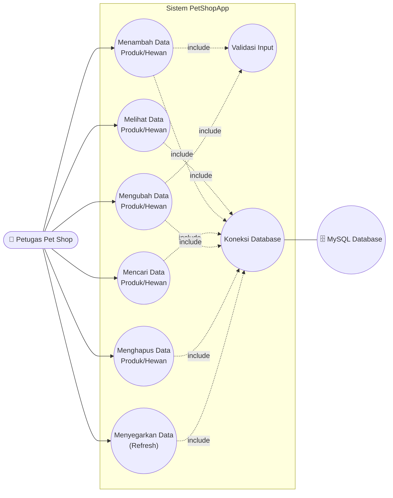
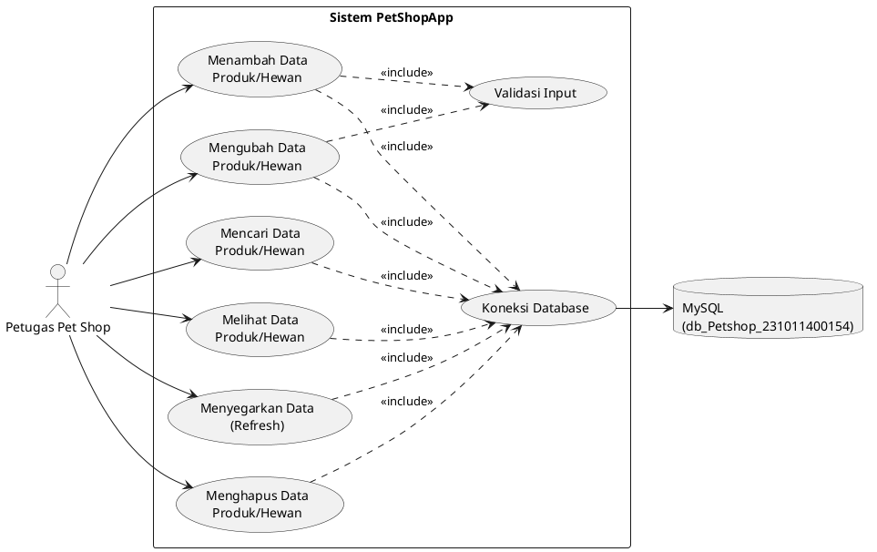
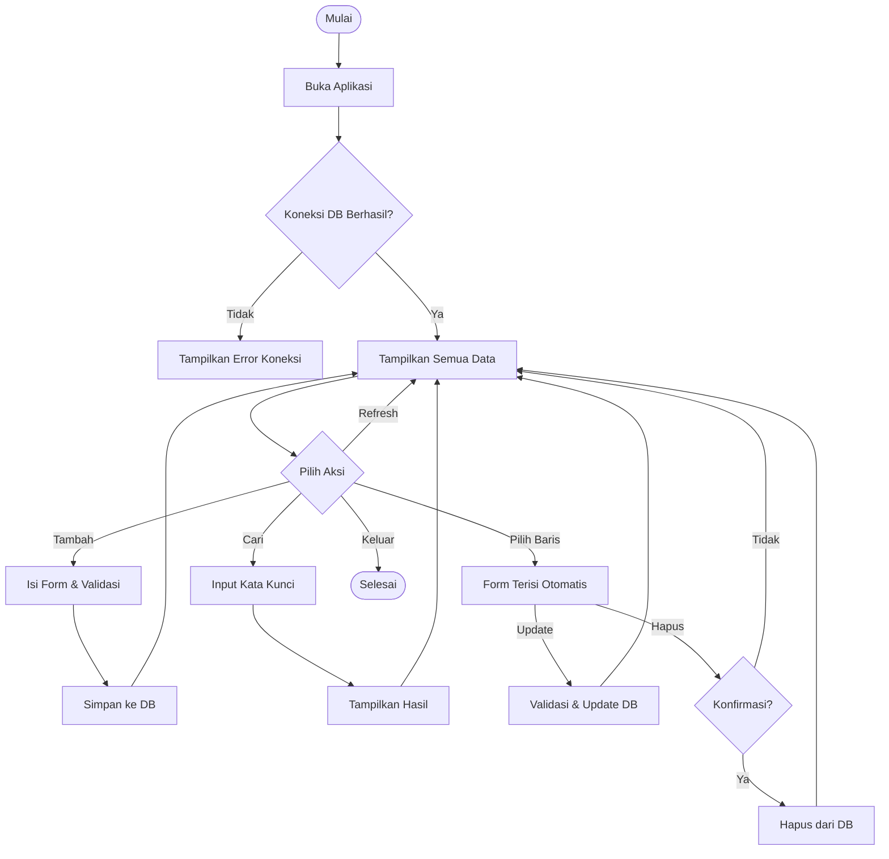

# 📋 Use Case Diagram & Deskripsi — PetShopApp

**Aplikasi:** Pet Shop Management System
**Developer:** Hizkia Siallagan — NIM 231011400154
**Institusi:** Universitas Pamulang (UNPAM)

---

## 1. Identifikasi Aktor

| Aktor | Deskripsi |
|---|---|
| **Petugas / Admin Pet Shop** | Satu-satunya aktor pengguna aplikasi. Bertanggung jawab mengelola seluruh data produk dan hewan peliharaan: menambah, melihat, mencari, mengubah, menghapus, dan memuat ulang data. |
| **Sistem Database (MySQL)** | Aktor pendukung (secondary actor) yang menyimpan dan mengembalikan data atas permintaan sistem melalui koneksi JDBC. |

> Aplikasi ini bersifat **single-actor system** (belum ada fitur multi-level user/login), sehingga seluruh use case dijalankan oleh aktor yang sama: **Petugas Pet Shop**.

---

## 2. Daftar Use Case

| Kode | Nama Use Case | Deskripsi Singkat |
|------|----------------|--------------------|
| UC-01 | Melihat Data Produk/Hewan | Menampilkan seluruh data dari database ke dalam tabel |
| UC-02 | Menambah Data Produk/Hewan | Menyimpan data baru ke database |
| UC-03 | Mencari Data Produk/Hewan | Mencari data berdasarkan kode, nama, atau jenis |
| UC-04 | Mengubah Data Produk/Hewan | Memperbarui data yang sudah ada |
| UC-05 | Menghapus Data Produk/Hewan | Menghapus data dari database |
| UC-06 | Menyegarkan Data (Refresh) | Memuat ulang data terbaru dari database |
| UC-07 | Validasi Input | Memvalidasi kelengkapan & format data sebelum disimpan (*include* dari UC-02 & UC-04) |
| UC-08 | Koneksi Database | Membuka koneksi ke MySQL saat aplikasi dijalankan (*include* di semua use case data) |

---

## 3. Use Case Diagram (Mermaid)

### Use Case Diagram (PlantUML — alternatif untuk draw.io / PlantUML render)

> 💡 **Catatan:** Untuk laporan TA (BAB III — Rancangan Antarmuka), diagram PlantUML di atas bisa di-render ke gambar via https://www.plantuml.com/plantuml/ lalu di-import ke draw.io, atau digambar ulang langsung di draw.io mengikuti struktur aktor → use case di atas.

---

## 4. Deskripsi Detail Tiap Use Case

### UC-01 — Melihat Data Produk/Hewan
| Item | Keterangan |
|---|---|
| **Aktor** | Petugas Pet Shop |
| **Deskripsi** | Aktor melihat seluruh daftar data produk/hewan yang tersimpan di database |
| **Precondition** | Aplikasi telah terbuka dan koneksi database berhasil |
| **Trigger** | Aplikasi pertama kali dijalankan, atau aktor membuka tab data |
| **Main Flow** | 1. Aktor membuka aplikasi. 2. Sistem otomatis memanggil method `tampilkanSemua()` pada DAO. 3. Sistem mengambil seluruh baris dari tabel `produk_hewan`. 4. Sistem menampilkan data ke dalam `JTable`. |
| **Alternative Flow** | Jika data kosong, tabel ditampilkan tanpa baris (kosong) tanpa error |
| **Exception Flow** | Jika koneksi database gagal → sistem menampilkan dialog error "Gagal konek ke database" |
| **Postcondition** | Data produk/hewan tampil di tabel utama |

---

### UC-02 — Menambah Data Produk/Hewan
| Item | Keterangan |
|---|---|
| **Aktor** | Petugas Pet Shop |
| **Deskripsi** | Aktor menambahkan data produk/hewan baru ke dalam sistem |
| **Precondition** | Form input kosong/siap diisi |
| **Trigger** | Aktor menekan tombol **Tambah** |
| **Main Flow** | 1. Aktor mengisi field: kode, nama, jenis, stok, harga. 2. Aktor menekan tombol **Tambah**. 3. Sistem menjalankan **UC-07 Validasi Input**. 4. Jika valid, sistem menjalankan `INSERT` ke tabel `produk_hewan`. 5. Sistem menampilkan notifikasi sukses dan me-refresh tabel. |
| **Alternative Flow** | Jika kode sudah ada (duplikat Primary Key), sistem menampilkan pesan error dari database |
| **Exception Flow** | Jika ada field kosong/format salah → sistem menampilkan peringatan dan proses dibatalkan |
| **Postcondition** | Data baru tersimpan di database dan tampil di tabel |

---

### UC-03 — Mencari Data Produk/Hewan
| Item | Keterangan |
|---|---|
| **Aktor** | Petugas Pet Shop |
| **Deskripsi** | Aktor mencari data tertentu berdasarkan kata kunci |
| **Precondition** | Terdapat data pada database |
| **Trigger** | Aktor mengetik kata kunci lalu menekan tombol **Cari** |
| **Main Flow** | 1. Aktor mengetik kata kunci pada field pencarian (kode/nama/jenis). 2. Aktor menekan tombol **Cari**. 3. Sistem menjalankan query `SELECT ... WHERE` dengan kondisi `LIKE`. 4. Sistem menampilkan hasil pencarian pada tabel. |
| **Alternative Flow** | Jika kata kunci kosong, sistem menampilkan seluruh data (sama seperti UC-01) |
| **Exception Flow** | Jika tidak ditemukan hasil → tabel ditampilkan kosong |
| **Postcondition** | Tabel menampilkan data sesuai kata kunci pencarian |

---

### UC-04 — Mengubah Data Produk/Hewan
| Item | Keterangan |
|---|---|
| **Aktor** | Petugas Pet Shop |
| **Deskripsi** | Aktor memperbarui data produk/hewan yang sudah ada |
| **Precondition** | Aktor telah memilih salah satu baris data pada tabel |
| **Trigger** | Aktor menekan tombol **Update** setelah mengubah isi form |
| **Main Flow** | 1. Aktor memilih (klik) baris data pada tabel. 2. Sistem mengisi form otomatis dari data terpilih. 3. Aktor mengubah salah satu/beberapa field. 4. Aktor menekan tombol **Update**. 5. Sistem menjalankan **UC-07 Validasi Input**. 6. Sistem menjalankan `UPDATE` pada database berdasarkan `kode`. 7. Sistem menampilkan notifikasi sukses dan me-refresh tabel. |
| **Alternative Flow** | Jika belum memilih data, sistem menampilkan peringatan "Pilih data terlebih dahulu" |
| **Exception Flow** | Jika field tidak valid → proses dibatalkan dengan pesan error |
| **Postcondition** | Data pada database telah diperbarui sesuai input baru |

---

### UC-05 — Menghapus Data Produk/Hewan
| Item | Keterangan |
|---|---|
| **Aktor** | Petugas Pet Shop |
| **Deskripsi** | Aktor menghapus data produk/hewan dari sistem |
| **Precondition** | Aktor telah memilih salah satu baris data pada tabel |
| **Trigger** | Aktor menekan tombol **Hapus** |
| **Main Flow** | 1. Aktor memilih baris data pada tabel. 2. Aktor menekan tombol **Hapus**. 3. Sistem menampilkan dialog konfirmasi. 4. Aktor menekan **Yes**. 5. Sistem menjalankan `DELETE` berdasarkan `kode`. 6. Sistem menampilkan notifikasi sukses dan me-refresh tabel. |
| **Alternative Flow** | Jika aktor menekan **No/Cancel** pada dialog konfirmasi, proses dibatalkan dan data tidak terhapus |
| **Exception Flow** | Jika belum memilih data → sistem menampilkan peringatan |
| **Postcondition** | Data terhapus dari database dan tidak lagi tampil di tabel |

---

### UC-06 — Menyegarkan Data (Refresh)
| Item | Keterangan |
|---|---|
| **Aktor** | Petugas Pet Shop |
| **Deskripsi** | Aktor memuat ulang data terkini dari database, berguna jika data diubah dari sumber lain |
| **Precondition** | Aplikasi sedang berjalan dan terkoneksi ke database |
| **Trigger** | Aktor menekan tombol **Refresh** |
| **Main Flow** | 1. Aktor menekan tombol **Refresh**. 2. Sistem memanggil ulang `tampilkanSemua()`. 3. Sistem memperbarui isi tabel dengan data terbaru. |
| **Alternative Flow** | — |
| **Exception Flow** | Jika koneksi terputus → sistem menampilkan dialog error koneksi |
| **Postcondition** | Tabel menampilkan data ter-update dari database |

---

### UC-07 — Validasi Input *(include)*
| Item | Keterangan |
|---|---|
| **Aktor** | Sistem (dipanggil otomatis oleh UC-02 & UC-04) |
| **Deskripsi** | Memastikan seluruh field wajib terisi dan format data (angka untuk stok/harga) benar sebelum data disimpan |
| **Main Flow** | 1. Sistem memeriksa apakah field kode/nama/jenis kosong. 2. Sistem memeriksa apakah stok & harga berupa angka valid. 3. Jika semua valid, proses dilanjutkan ke operasi database. |
| **Exception Flow** | Jika tidak valid, sistem menampilkan pesan peringatan dan proses dihentikan |

---

### UC-08 — Koneksi Database *(include)*
| Item | Keterangan |
|---|---|
| **Aktor** | Sistem (dipanggil otomatis oleh seluruh use case data) |
| **Deskripsi** | Membuka koneksi JDBC ke MySQL menggunakan driver `com.mysql.cj.jdbc.Driver` setiap kali sistem membutuhkan akses data |
| **Main Flow** | 1. Sistem memuat driver JDBC. 2. Sistem membuka koneksi ke `db_Petshop_231011400154`. 3. Koneksi digunakan untuk eksekusi query, kemudian ditutup. |
| **Exception Flow** | Jika driver tidak ditemukan atau server MySQL tidak aktif → sistem menampilkan dialog error koneksi |

---

## 5. Activity Flow Singkat (Alur Umum Aplikasi)

---

## 6. Ringkasan Pemetaan Fitur ↔ Kode Program

| Use Case | Method di `ProdukDAO.java` | Method di `MainFrame.java` |
|---|---|---|
| UC-01 Melihat Data | `tampilkanSemua()` | `loadTable()` |
| UC-02 Tambah Data | `tambah()` | `aksiTambah()` |
| UC-03 Cari Data | `cari()` | (search handler) |
| UC-04 Update Data | `update()` | `aksiUpdate()` |
| UC-05 Hapus Data | `hapus()` | `aksiHapus()` |
| UC-06 Refresh Data | `tampilkanSemua()` | `loadTable()` |
| UC-07 Validasi Input | — | `validasiForm()` |
| UC-08 Koneksi Database | — | `DatabaseConnection.getConnection()` |

---

Dokumen ini dapat langsung dilampirkan pada **BAB III (Analisis & Perancangan)** atau **Lampiran** Laporan Tugas Akhir.
